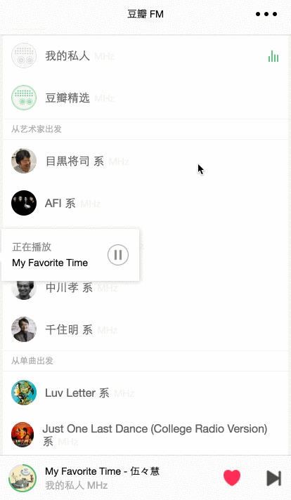

# 豆瓣 FM (第三方)微信小程序客户端

## 环境要求

由于使用 webpack 2.0, 需要 `Node.js` 5.0 以上

## 运行

```js
npm run start
```

微信开发者工具中项目路径指向 `dist` 目录即可


## 运行截图



### .nvmrc

可以通过 nvm 与 zsh 的集成打到切换目录后自动切换 node.js 版本, 更多参见 [https://github.com/creationix/nvm/blob/master/README.md#nvmrc](https://github.com/creationix/nvm/blob/master/README.md#nvmrc)
